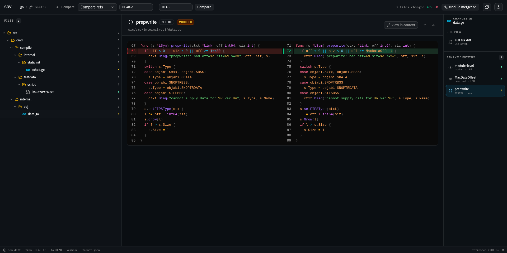

# Semantic Diff Viewer



A local browser UI for Git worktree diffs with entity-level semantic details
from [`sem`](https://github.com/ataraxy-labs/sem).

## Requirements

- macOS or Linux
- Node.js 22.12+
- `sem` available in `PATH`
- A Git worktree

## Run

Build and link the local binary once:

```bash
pnpm install
pnpm build
pnpm link --global .
```

Then run SDV from any Git repository:

```bash
sdv
```

SDV inspects the Git worktree in the directory where it is launched. The server
starts at `http://127.0.0.1:1555` and prints `Running on localhost:1555`; it
does not open a browser unless `--open` is passed.

The default view displays all changes from `HEAD` to the working tree,
including staged, unstaged, and untracked files. The comparison bar can switch
to staged changes or compare two Git refs such as `HEAD~3` and `HEAD`. Recent
commits are offered as searchable suggestions, and arbitrary valid refs are
accepted.

Use the refresh button to rerun the active comparison. The default command is:

```bash
sem diff HEAD --verbose --format json
```

`sem` remains the source of truth for semantic entities. Git status/diff output
is used for repository dirty state, untracked files, and full-file diffs.

## CLI options

```text
-p, --port <number>  Server port (default: 1555)
--host <host>        Server host (default: 127.0.0.1)
--open               Open the browser automatically
-V, --version        Print the SDV version
-h, --help           Show help
```
